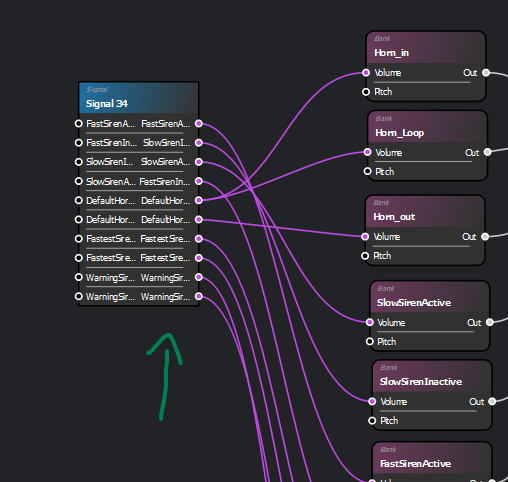
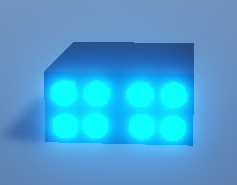
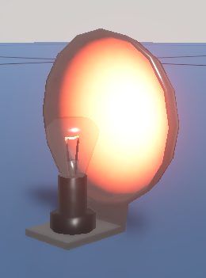

# Further modding

- [Further modding](#further-modding)
  - [Sounds](#sounds)
    - [Replacing existing sounds](#replacing-existing-sounds)
    - [Adding new sounds](#adding-new-sounds)
  - [Modding light bars](#modding-light-bars)
    - [Light types](#light-types)
    - [Emissive assets](#emissive-assets)
      - [Animation](#animation)
      - [Texturing](#texturing)
      - [Enclosure](#enclosure)
    - [Light entities](#light-entities)
  - [Custom knob](#custom-knob)
  - [Setting up a new vehicle](#setting-up-a-new-vehicle)

---

## Sounds

You can create new sounds by using an existing one and trimming it on the right place (right frequency and [zero crossing](https://en.wikipedia.org/wiki/Zero_crossing)) for a smooth loop using an audio program like [Audacity](https://www.audacityteam.org/) or you can generate it by using a [tool](https://github.com/12gabriel3/sirenGenerator) built specifically for that by one of our members.

### Replacing existing sounds

With the `.wav` file in hand, just replace the desired audio file located in `Sounds/Siren/`

### Adding new sounds

Before adding the sound, think of a good name, such as `MyCoolSiren` (can be whatever you'd like). Put the desired audio file in `Sounds/Siren/` and right click and import it.
Open `Scripts\Game\Components\Vehicle\EL_SirenManagerComponent.c` and look for this code in the class `EL_SirenMode` around line 115:

```cs
static protected const ref ParamEnumArray SIREN_SOUNDS = 
{
    new ParamEnum("Silent", "0"),
    new ParamEnum("DefaultHorn", "1"),
    new ParamEnum("SlowSiren", "2"),
    new ParamEnum("FastSiren", "3"),
    new ParamEnum("FastestSiren", "4"),
    new ParamEnum("WarningSiren", "5"),
    new ParamEnum("MyCoolSiren", "6")     // <--- Your new sound is here
};
```

Open `Sounds/Siren/Vehicles_Siren.sig` in the audio editor. Make a new input and output both called `MyCoolSirenActive` and connect them. Do it again but this time called `MyCoolSirenInactive`.

Open `Sounds/Siren/Vehicles_Siren.acp`, your new signals should be here:


Create 2 new `BankLocal`s, and add the same `.wav` file to each bank. Configure it how you would like. I recommend an infinite loop and fade in and fade out time of 50ms. Name it according to the audio (for organization purposes only).

Connect the audio signals like so:
`MyCoolSirenActive --Volume--> BankLocal1 --Port1--> Selector30`
`MyCoolSirenInactive --Volume--> BankLocal2 --Port2--> Selector30`
You can use the other audios as reference.

After doing that you should be able to select the audio in `El_SirenManagerComponent`.

---

## Modding light bars

This guide does not cover the basics of 3D modeling, texturing or animations, only the parts specific to Enfusion Engine.

### Light types


There are 2 types of light in Enfusion: emmissive surfaces and `LightEntity`s. `LightEntity`s create the *illusion* that emmissive surfaces emmit light. You can attach `LightEntity`s to emmissive surfaces in the `EL_LightComponent` of the emmissive entity. Create a `LightEntity` and save it as a prefab. Then select the prefab in the `EL_LightComponent`.  I reccomend never exceeding 2 `LightEntity`s per vehicle. On console you might not even want to use `LightEntity`s as they are very taxing.

### Emissive assets

 

You might opt to use a modular approach, making each emissive surface separate from the enclosure. This allows you to control each emissive separately and reuse the already available assets in `Prefabs/Vehicles/EmergencyLights/Base/`. If you opt to use the non modular approach, making the light bar a single asset, you wont be able to control each light separately, but you will find this guide useful nonetheless.

Each emissive asset you wish to control separately needs to be a separate `GameEntity` (note: not a `GenericEntity`). Each one with a `MeshObject`, `Hierarchy`, `ParametricMaterialInstanceComponent` and, in case it's animated (such as rotary lights), an `AnimationPlayerComponent`.

Materials that support emissiveness are MatPBRBasic and MatPBRDecal. Although not tested, you can make the emissive asset a decal.

#### Animation

After creating the animation in your preferred 3D software, export as fbx with the animation on rest position and import to the Workbench as a model. Check `Export skinning` on import setting (bottom right) and reimport. Then export another fbx with the animation on pose position and import it as an animation. This should give you the `.anm` file.

#### Texturing

You can find detailed information on the [official wiki](https://community.bistudio.com/wiki/Arma_Reforger:Textures). Emissive texture is particularly important.

If you took a modular approach or if your lights are all the same color, different emissive colors should be set in `EL_LightComponent`, not the texture. This allows for more flexibility. You can configure the color and emissive multiplier in the `EL_LightComponent`.

#### Enclosure

If you took the modular approach, when making the enclosure set [empty objects](https://docs.blender.org/manual/en/latest/modeling/empties.html) at the exact position you wish to attach the emissive to. Make sure you export them to the `fbx` and when importing to the Workbench, check `Export Skinning` or `Export scene hierarchy` to import the empty objects as snapping points.

After making the emissive asset as a `GameEntity` and with the required components, open the World Editor and drag and drop the enclosure `.xob` into the window. Drag and drop the emissive components on the `GenericEntity` created on the previous step to parent them. On the `Hierarchy` component, select the pivot point (if you cant see the pivot points, see previous paragraph). Give them convinent names on `EL_LightComponent` to be referenced by the animation.

To work with current animations, lights must be named from left1 to left5 from inside to oustide and same on the right side.

You can change colors and intesity of the emissive by configuring it in `EL_LightComponent`.

### Light entities

To attach light entities to emissives, select the `EL_LightComponent` and configure it there.

To create the illusion that all the emissive assets are projecting the light you need to place the `LightEntity` on a smart way. Utilize the near plane, offset, the parent emissive and the animations in conjunction to achieve a believable effect. Take the LED bar as an example:


This is the front view of the light bar. Each rectangle represents an emissive and the circles are the near planes of the `LightEntity`s. When the blue emissive is set to on, it spawns the blue `LightEntity` and same for the green. The positioning of the `LightEntity`s achieves a number of things:

1. The size creates an illusion that illumination comes from different emissives.
2. The shift to the outside makes the vehicle illuminate its surroundings better.
3. The emissive that spawns the `LightEntity` in conjunction with the [animations](basic_usage.md#m151a2-with-led-light-bar) helps create a sense of gradual lighting on the leftmost animation and a perceived change between steps on the middle one.
4. The slight shift upwards prevents the light from bleeding into the cockpit during turns

With all this set up, you can parent it to a vehicle set up with the knob and actions and, with the right [animations](advanced_usage.md#animation), it is going to work.

---

## Custom knob

Make a model and set up the procedural animation as usual. The knob prefab must have:

- `MeshObject` with a collider
- `RigidBody` set to `AlwaysActive`
- `ProcAnimComponent`
- `SignalsManagerComponent`
- `Hierarchy`
- `EL_SirenKnobComponent`

You can set the procedural animation signals for each mode in `EL_SirenManagerComponent` under `KnobSignals`.

---

## Setting up a new vehicle

It is advisable that you make a *base* vehicle prefab with just the knob and the actions and then add different versions that extend it.

1. Open the vehicle prefab you wish to mod.
2. Add the knob prefab as a child of the vehicle (doesnt need to be direct child).
3. In the `ActionsManagerComponent` of the vehicle add an Action Context and place it over the knob.
4. Add `EL_SirenModeAction`s and [configure](advanced_usage.md#changing-modes-display-names) them.
5. Add an `EL_SirenManagerComponent` to the vehicle.
6. Drag the vehicle entity to the file explorer to save it.

For each new vehicle with a different light variation:

1. Open the base prefab you just created.
2. Add a light bar as a child (doesnt need to be direct child).
3. [Configure](advanced_usage.md#configuring-each-mode) the siren modes in `EL_SirenManagerComponent`.
4. Drag the prefab to the file explorer to save.
